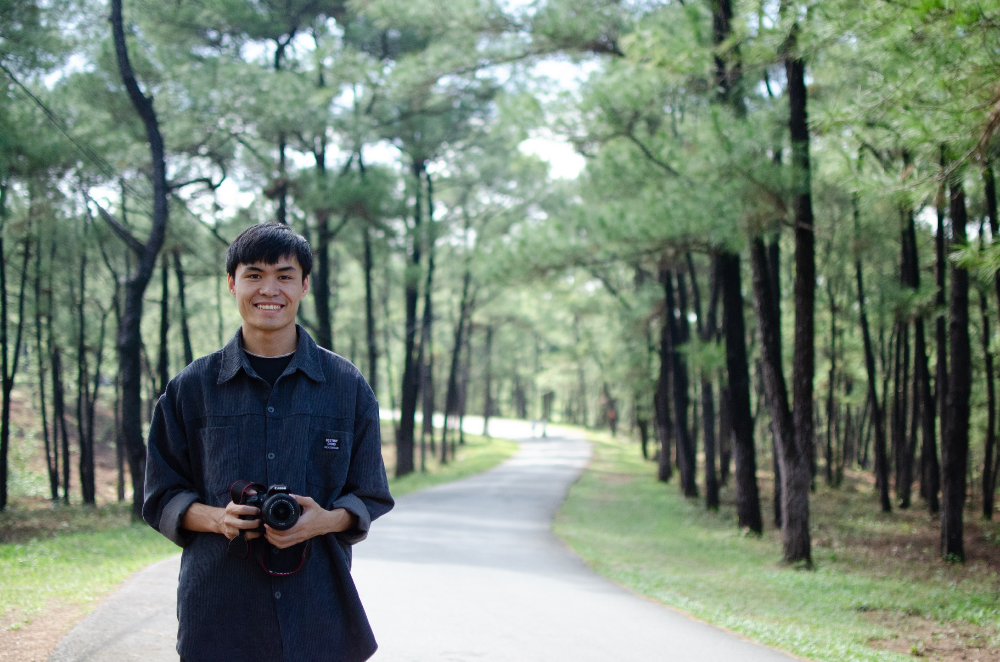

### Hi there 👋, **I'm Tuan-Cuong Vuong (Computer Science)** 

 

 

<!--
**cngvng/cngvng** is a ✨ _special_ ✨ repository because its `README.md` (this file) appears on your GitHub profile.

Here are some ideas to get you started:

- 🔭 I’m currently working on ...
- 🌱 I’m currently learning ...
- 👯 I’m looking to collaborate on ...
- 🤔 I’m looking for help with ...
- 💬 Ask me about ...
- 📫 How to reach me: ...
- 😄 Pronouns: ...
- ⚡ Fun fact: ...
-->

## About Me

- **Overall ~2 years of experience in IT 🖥️.**
- **Specialize in Research Assistant with 2+ years in [AIoT Lab](http://aiot.phenikaa-uni.edu.vn), where I am mentored by the esteemed [Dr. Luong Van Thien](https://tvluong.wordpress.com/).**
- **I am one of the student members of the [APSIPA conference](http://www.apsipa.org).**
- **I am currently pursuing a Bachelor’s degree in Computer Science with a specialization in Data Science and Artificial Intelligence program at [Phenikaa University](https://phenikaa-uni.edu.vn/en).**

#### Let's Connect On:

## What I'm doing presently?

- 🔭 My primary research interests involve leveraging computer vision techniques to solve real-world challenges.
- 👯 I’m looking to collaborate on **Open Source** and **AI** projects. 
- 💬 Ask me *anything* about `Technology`
- 📫 <a href="mailto:cngvng123@gmail.com">Send an email</a> 
- 😄 Pronouns: He / Him
- ⚡ Fun fact: I love AI and programming.

 
 

 
 

 
 

 
 
 

 

